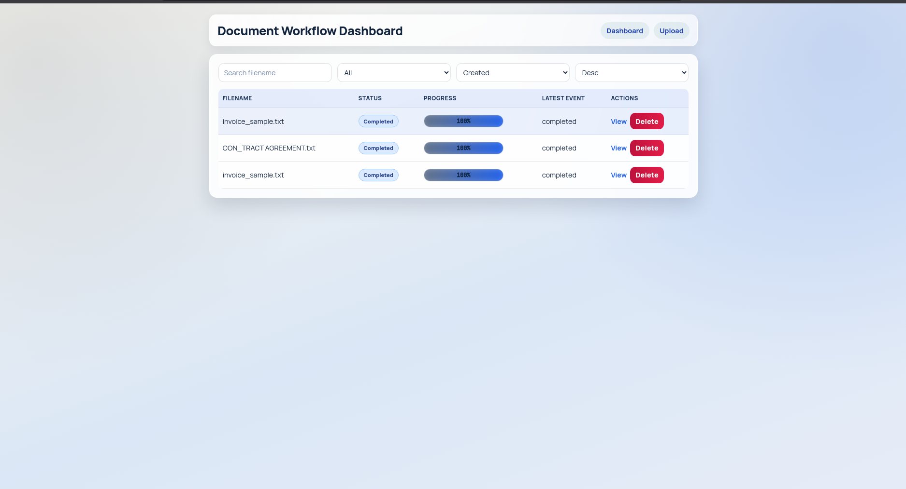
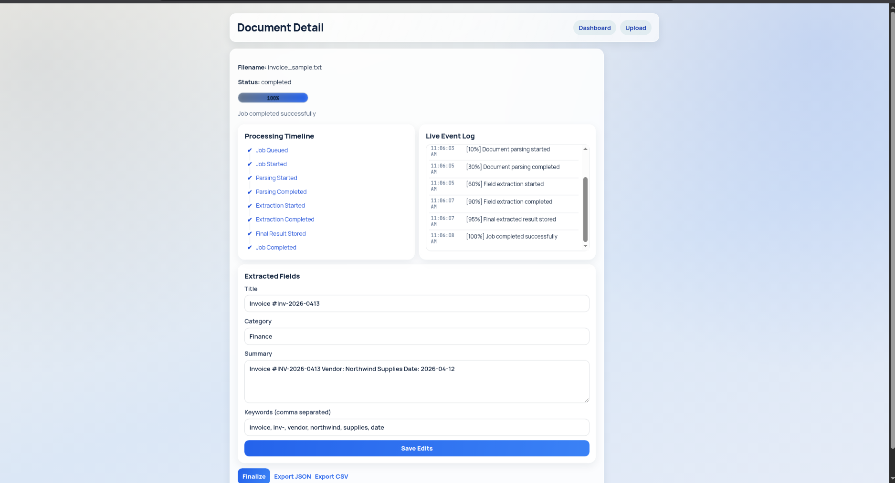

# Async Document Processing Workflow System

Production-style full-stack system for asynchronous document workflows with live progress tracking.

## Stack
- Frontend: Next.js (TypeScript)
- Backend: FastAPI (Python)
- Database: PostgreSQL
- Background Jobs: Celery
- Messaging + Progress: Redis Pub/Sub

## Architecture

```text
+-------------------+         +------------------------+
| Next.js Frontend  | <-----> | FastAPI Backend (/api) |
| - Upload UI       |  HTTP   | - REST endpoints       |
| - Dashboard       | + WS    | - WebSocket stream     |
| - Detail/Edit     |         | - DB persistence       |
+-------------------+         +-----------+------------+
                                          |
                                          | enqueue task
                                          v
                               +------------------------+
                               | Celery Worker          |
                               | - staged processing    |
                               | - progress publish     |
                               +-----------+------------+
                                           |
                         +-----------------+-----------------+
                         |                                   |
                         v                                   v
              +----------------------+            +------------------+
              | Redis (broker+pubsub)|            | PostgreSQL       |
              | - Celery broker      |            | - documents      |
              | - job_progress:<id>  |            | - jobs           |
              +----------------------+            | - job_events     |
                                                  | - extracted data |
                                                  +------------------+
```

## Screenshots

### Dashboard



### Extracted Output



### Demo Walkthrough

1. Open the dashboard (`dashboard.png`) and verify document rows, status badges, progress bars, and actions.
2. Upload one or more files from `samples/input/` and confirm new jobs appear as `queued`/`processing`.
3. Observe real-time progress updates over WebSocket as the worker publishes Redis events.
4. Open a document detail page (`output.png`) to review title, category, summary, and keywords.
5. Edit extracted fields, save changes, then finalize the record.
6. Export the finalized result as JSON and CSV.
7. Use Retry on failed jobs and Delete on non-processing documents to validate operational controls.

## Project Structure

```text
backend/
  app/
    api/
    core/
    models/
    schemas/
    services/
    workers/
    utils/
  main.py

frontend/
  src/
    components/
    pages/
    hooks/
    services/

docker-compose.yml
```

## Implemented Endpoints

- `POST /api/upload`
  - Upload one or many files
  - Creates `documents` rows + `jobs` rows
  - Enqueues Celery task per file

- `GET /api/documents`
  - Search (`search`)
  - Status filter (`status`)
  - Sorting (`sort_by`, `sort_order`)

- `GET /api/documents/{id}`
  - Document detail + extracted result + latest job

- `GET /api/jobs/{id}/progress`
  - Polling progress snapshot

- `GET /api/jobs/{id}/events`
  - Persisted event history for timeline/log hydration

- `GET /api/jobs/{id}/progress/stream`
  - SSE stream from Redis Pub/Sub events

- `GET /ws/jobs/{id}`
  - WebSocket stream from Redis Pub/Sub events

- `POST /api/jobs/{id}/retry`
  - Retries failed jobs by creating a new queued job

- `PUT /api/documents/{id}`
  - Updates extracted fields

- `POST /api/documents/{id}/finalize`
  - Marks extracted result as finalized

- `GET /api/documents/{id}/export?format=json|csv`
  - Export extracted payload as JSON or CSV

## Async Workflow Stages

Celery worker publishes and persists these stages:

1. `job_queued`
2. `job_started`
3. `document_parsing_started`
4. `document_parsing_completed`
5. `field_extraction_started`
6. `field_extraction_completed`
7. `final_result_stored`
8. `job_completed` or `job_failed`

Each event is published to Redis channel: `job_progress:{job_id}`

Event payload:

```json
{
  "job_id": "string",
  "status": "string",
  "progress": 55,
  "message": "Field extraction started",
  "timestamp": "2026-04-14T05:02:28.164000+00:00"
}
```

Events are also persisted to `job_events` and used by the detail page timeline and live event log.

## Local Setup (Docker)

### 1. Start services

```bash
docker compose up --build
```

Services:
- Frontend: `http://localhost:3000`
- Backend API: `http://localhost:8000`
- Backend docs: `http://localhost:8000/docs`

### 2. Stop services

```bash
docker compose down
```

## Local Setup (Without Docker)

### Backend

```bash
cd backend
python -m venv .venv
source .venv/bin/activate
pip install -r requirements.txt
cp .env.example .env
uvicorn main:app --reload
```

Run Celery in another terminal:

```bash
cd backend
source .venv/bin/activate
celery -A app.core.celery_app.celery_app worker --loglevel=info
```

### Frontend

```bash
cd frontend
npm install
cp .env.local.example .env.local
npm run dev
```

## Frontend Features
- Upload page with multi-file submission
- Dashboard with search, status filter, sorting
- Live progress bars via WebSocket
- Document detail processing timeline (completed/current/pending/failed)
- Document detail live event log with auto-scroll
- Document detail editing for extracted fields
- Finalize action
- Retry failed job action
- Delete document action with confirmation and loading state
- JSON/CSV export actions

## Submission Artifacts
- Demo video: add your 3-5 minute walkthrough link here.
- Sample test files: `samples/input/invoice_sample.txt`, `samples/input/contract_sample.txt`
- Sample exported outputs: `samples/output/sample_export.json`, `samples/output/sample_export.csv`

### Suggested Demo Video Flow (3-5 min)
1. Show architecture quickly (frontend, API, worker, Redis, PostgreSQL).
2. Upload multiple documents from `samples/input/`.
3. Show live dashboard progress updates and status transitions.
4. Open a document detail page, edit extracted fields, and finalize.
5. Trigger export as JSON and CSV.
6. Demonstrate retry by forcing/using a failed job scenario.

## Assumptions
- File content parsing is mocked; metadata and deterministic mock extraction are used.
- `documents.status` mirrors current/last relevant job state.
- Retry creates a new job record rather than mutating the failed job.

## Tradeoffs
- SQLAlchemy tables are auto-created at startup for simplicity; no Alembic migration flow is wired yet.
- WebSocket stream is one channel per job and opened on demand from the UI.
- Extraction logic is intentionally mocked to focus on workflow architecture.

## Limitations
- No authentication/JWT implemented (bonus item not enabled).
- No cancel-job endpoint implemented (bonus item not enabled).
- Minimal automated tests are not included in this initial version.

## Notes
- Processing is never done in the API request cycle.
- All progress updates are emitted by Celery worker and consumed in real-time by frontend through backend WebSocket.
